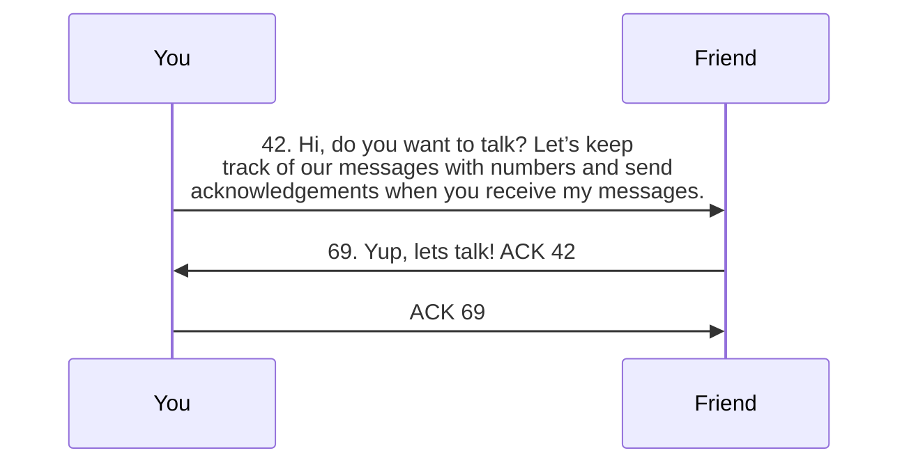
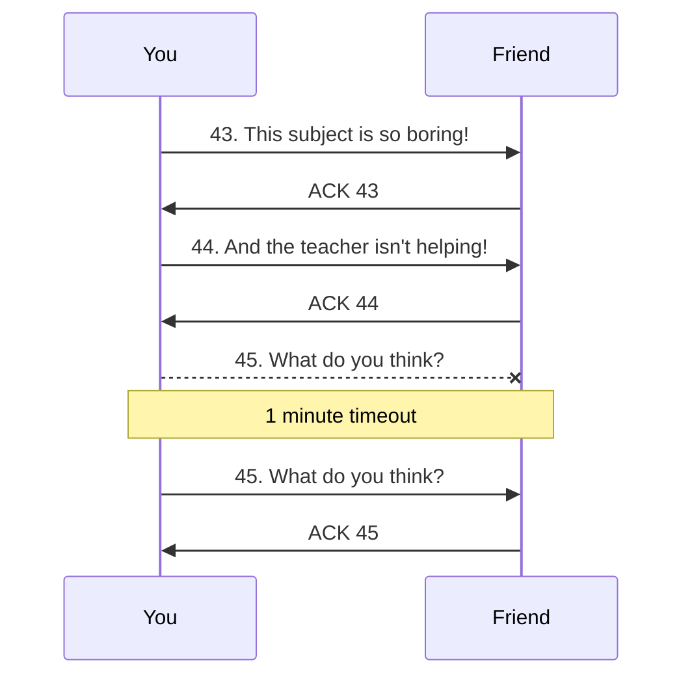
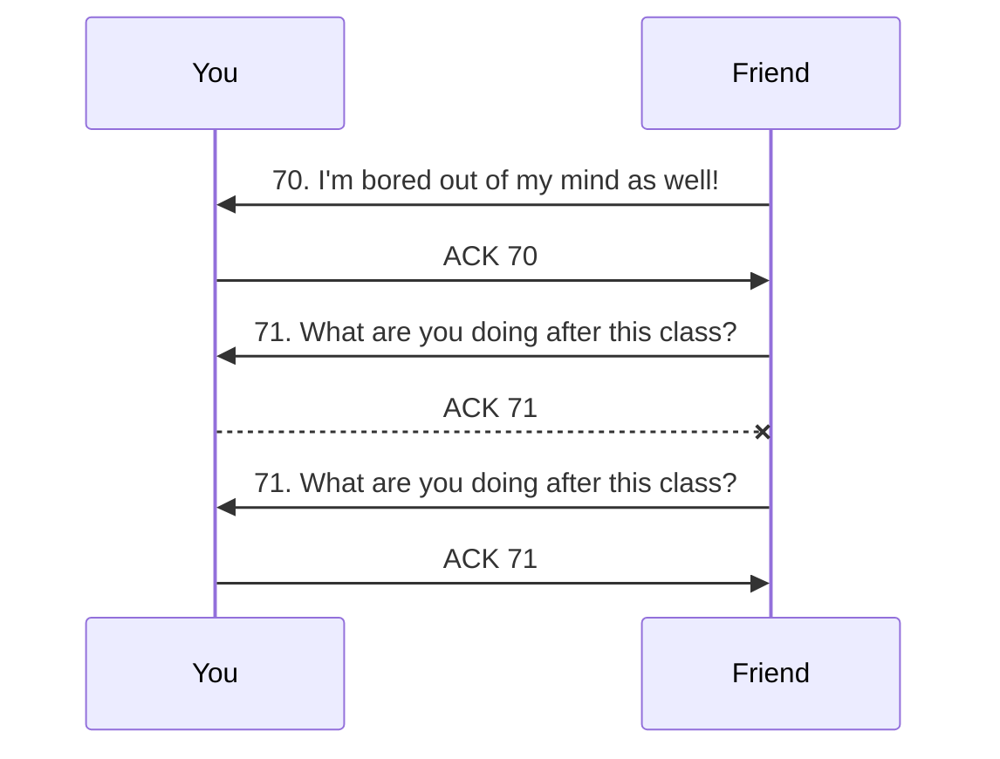
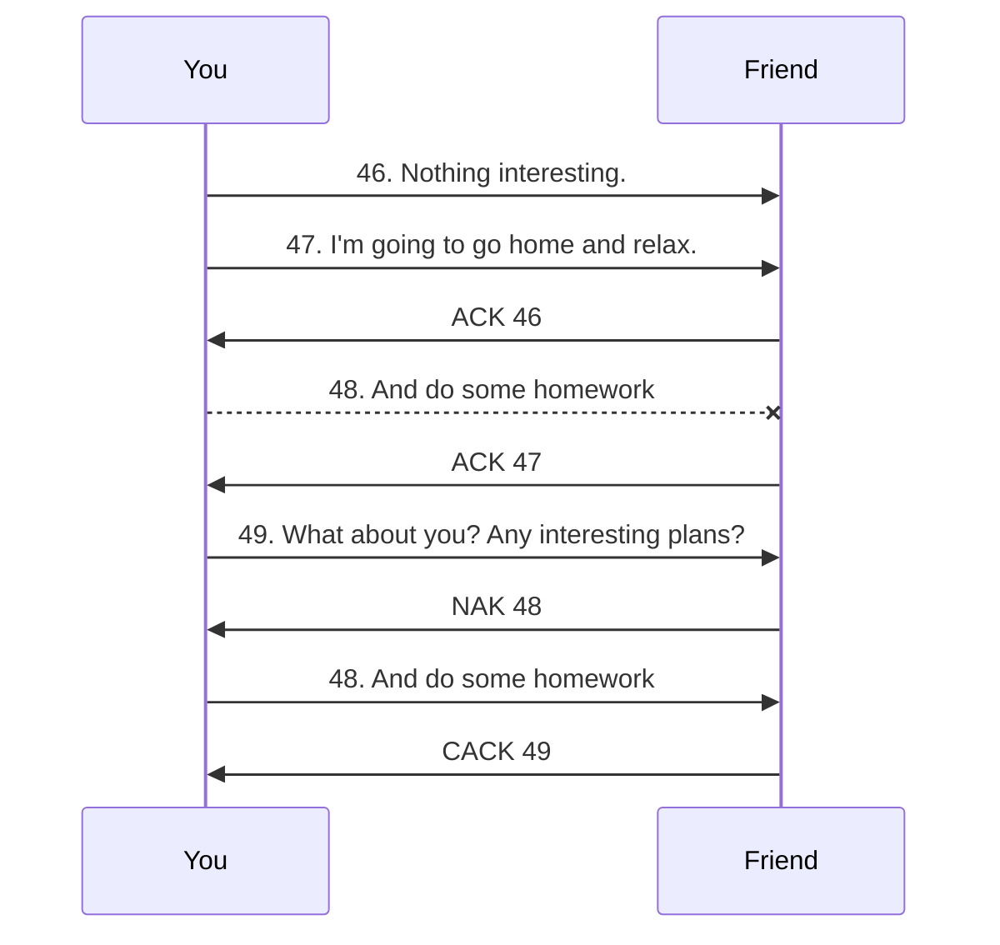
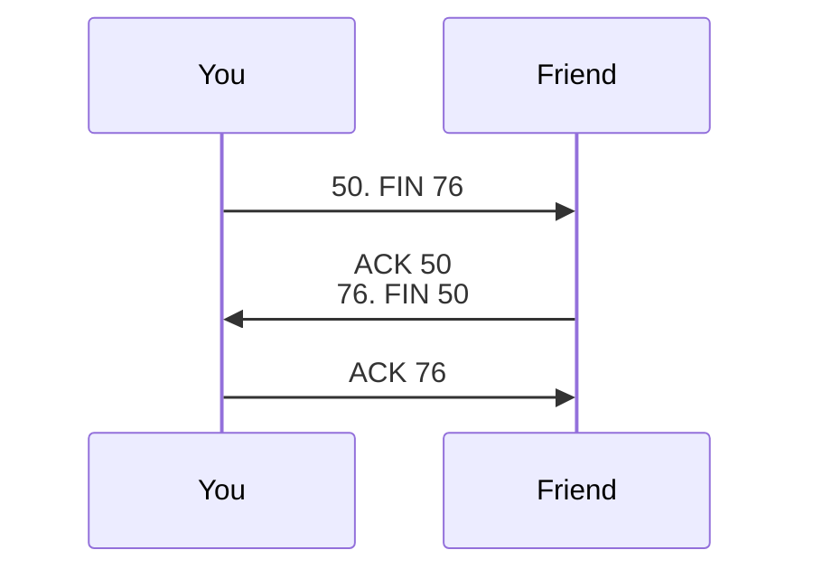

You are sitting in \<the class you hate\>. The teacher is droning on about something and you are bored. You spot your friends sitting *across* the room. Ugh! Why did they have to sit *there*! Luckily, they appear just as bored as you are. You want to talk somehow, so you need to think about something creative. Hand gestures? Too much effort, plus you would be in trouble if you were caught. You think about paper balls, but that would be wasting too much paper. You finally decide to get help from your classmates, and pass post-it notes to your friend.

#### The problem

Unfortunately, you are faced with another problem: because your classmates are just as bored as you are, they might think they have better ideas for your post-it notes, like origami, or paper balls to throw in the bin. Luckily, you paid attention in your networking class, so you have some tricks up your sleeve. You are confident that with a bit of work, you can guarantee you can communicate flawlessly with your friend.

#### Three way handshake

Deciding that this would work, you send your friend this message:



42. Hi, do you want to talk? Let's keep track of our messages with numbers and send acknowledgements when you receive my messages.



Your friend replies with



69. Yup, lets talk! You sent me message #42.



Woohoo! your system seems like it is working. Although this may seem a bit arbitrary right now, this will start making perfect sense soon. 

So, you send the appropriate acknowledgement. Notice that acknowledgements do not need numbers.



I'm acknowledging message #69.





The messages you send to your friend are highlighted



like this,



and the messages your friend sends to you are



highlighted like this.



Also, I will be replacing `I'm acknowledging message #69` with just `ACK 69` from this point. They mean the same thing, ACK is just a shorthand for acknowledge.



Now that you have established the connection and the rules of exchange, you are ready to send messages to your friend! Before that, however, let's look at the messages sent so far in a nice diagram:

This was what is known as a 3-way handshake in technical-speak. The beauty of this is that your classmates can fail to pass any of these messages, and you would know(If this is confusing, take this as a given for now, and read on).

#### Sending messages

Now that you know your friend understands the rules of the exchange, you send the following messages



43. This subject is so boring!





ACK 43





44. And the teacher isn't helping!





ACK 44





45. What do you think?



You wait for a minute, then realize that your friend isn't responding. Did someone decide to turn your note into a [duck](https://en.wikipedia.org/wiki/Orizuru)? Duck!

#### Lost messages

This is where the acknowledgements and the numbers help you: since your friend hasn't responded, you can conclude that either your message was lost, or the acknowledgement was lost. In the first case, you can just send the message again, and get ACK as usual. In the second case as well, you can send the message again. This won't make a difference, because when you re-transmit the message, your friend will see the duplicate number, and can conclude that you didn't receive the acknowledgement. So, they can simply re-transmit the acknowledgement. Either way, you get the acknowledgement. So, you resend the message.



45. What do you think?



It looks like your message was transferred successfully, so you get an acknowledgement:



ACK 45



Before we proceed, let's look at a diagram of what just happened(the dashed line means the message was lost):

Now, your friend responds:



70. I'm bored out of my mind as well!



And you send an acknowledgement:



ACK 70



And you get another message:



71. What are you doing after this class?





ACK 71



However, you receive message number 71 again:



71. What are you doing after this class?



This looks like your ACK was lost. However, we can simply re-transmit the ACK as discussed above.



ACK 71



We can show this interaction with this diagram:

That's neat, isn't it? Using this, we can guarantee that our message will be sent, and both parties will be certain that the message is received.

#### Faster messages

Although this is awesome, you notice one thing: you are idle for considerable time while you wait for acknowledgements. So, we need a way to send multiple messages at once. Right now, let's assume we can send two messages at once without waiting for acknowledgements. This number, two, is called the window size, and isn't arbitrary. However, the discussion on how this number is decided is outside the scope of this article, so let's assume we somehow found that two is the best number.



The method of choosing the optimal window size is called flow control, and is a very interesting topic in itself. If you are interested in learning more about this, good starting points for exploration could be [wikipedia.org/wiki/Sliding_window_protocol](https://en.wikipedia.org/wiki/Sliding_window_protocol) and [wikipedia.org/wiki/Flow_control_(data)](https://en.wikipedia.org/wiki/Flow_control_(data))



Continuing the conversation you are having, you send the following messages:



46. Nothing interesting.





47. I'm going to go home and relax.





ACK 46





48. And do some homework





ACK 47





49. What about you? Any interesting plans?



Now, assume message 48 was lost, but 49 was received. So, your friend sends a `Not Acknowledged` message, represented by NAK.



NAK 48



So, you resend message 48: 



48. And do some homework



Now, since your friend has message 48 as well as 49, they can send an cumulative acknowledgement for message 49, indicating that all messages until 49 have been recieved.



CACK 49





An interesting point to note here is that in this case, if you send a CACK for every packet, it behaves exactly like an ACK. So, you could replace all the preceding ACKs with CACKs, and it wouldn't make a difference. This also means that we can say that ACK means the same thing as CACK in our protocol. 



Let's look at the sequence diagram for this conversation:

This is a bit more complex than the previous interactions, but you can see that we can send multiple messages at a time, and we have a mechanism for recovering lost messages. In addition to NAKs, we also re-send messages after timeouts, just like in previous cases. For a more detailed example, you can see [this](https://www.semanticscholar.org/paper/Sliding-window-protocol-with-selective-repeat-ARQ%3A-Ikegawa-Takahashi/9b5eca7dbc5b511440f0cc56fbea6d91d2073a69/figure/2) image, which shows an example with window size of 5.

Another interesting point to notice is that thanks to our numbering, your friend can order the messages on their end very easily, even though message 48 was received after message 49.

#### Flow control

Now, your friend continues the conversation:



72. Homework doesn't sound like fun :/





73. I'm going to a party tonight!



Now, imagine a scenario where your classmate is asked to forward two messages at the same time, and therefore messes up the order of messages. For example, because messages 72 and 73 were sent almost at the same time, your classmate might pass 73 before 72. So, you receive message 73 before you get message 72. Take a moment and think what your response would be based on what we have discussed so far.

From your perspective, as soon as you receive 73 and not 72, you will send a `NAK 72`:



NAK 72



Then, you receive message 72, so you will send a cumulative acknowledgement:



CACK 73



Now, when your friend gets `NAK 72`, they will assume that the message was lost. So, they will retransmit the message:



72. Homework doesn't sound like fun :/



After this, they will receive your cumulative acknowledgement, letting them know that all messages until 73 have been received correctly.

However, you will then receive message 72 again. Remember that in this case, we simply re-send the acknowledgement:



DACK 72



When your friend receives this ACK, they will notice that this is an acknowledgement for a message that has already been acknowledged(in other words, a duplicate). Now, although they can simply ignore this, there is an interesting conclusion that can be drawn here: they are sending too many messages at once.

This means that the network cannot handle sending two messages at once, and they should reduce the window size. In our case, it will be reduced from 2 to 1, implying that we can send one message at a time without waiting for ACKs. Notice that now your classmate cannot mess up, because trying to forward less messages means that the accuracy increases.

The changing of window size to prevent conditions like we discussed is known as congestion control. In actual implementations, like the internet you are using to read this article, this reduction is done when three duplicate ACKs are received. We are using just one DACK to imply the need to reduce the window size for brevity.

Because this exchange was a bit more complex, we will use a different kind of diagram to show what's happening:

```mermaid
gantt
    dateFormat  MM
    axisFormat %M
    section Friend to You
    72. That doesn’t sound like fun          :a1, 01, 7m
    73. I'm going to a party tonight! :a2, 01, 6m
    72. That doesn’t sound like fun          :a3, after b1, 6m
    
    section You to Friend
    NAK 72 : b1, after a2, 3m
    CACK 73 : b2, after a1, 3m
    DACK 72 : b3, after a3, 3m
```

Here, we can see that 73 is received at time=6, and you respond with NAK. Then, you get 72 at time=7, and since all the messages upto 73 are safely received, you send CACK 73. When NAK is received by your friend, message 72 is retransmitted, and when you receive it at time=15, you send a DACK.

At this point, the window size is reduced to allow just one message at a time. So, the conversation can be continued: (I'm representing the entire conversation as a diagram now, for brevity)

```mermaid
gantt
    dateFormat  MM
    axisFormat %M
    section Friend to You
    74. Do you want to go with me?          :a1, 01, 7m
    CACK 49 :a2, after b2, 4m
    75. Great, I'll pick you up at 7.   :a3, after b2, 6m
    
    section You to Friend
    CACK 74 : b1, after a1, 4m
    49. Sure, that will be fun! : b2, after a1, 5m
    CACK 75 : b3, after a3, 1m
```

This is very similar to the first conversation just after the three way handshake. You might want to draw a sequence diagram to see how it would look.

#### Close sequence

Noticing that the class is about to end, you want to end the logical 'channel' of communication you created. So, you send a FIN message, with the last sequence number you had received. FIN just indicates that you have sent all the data that you would have liked to send, and you would like to end the connection. A typical exchange proceeds as follows:



50. FIN 75



Notice that we also added the number of the last message we received to FIN. This is to tell your friend that you have received the messages until 75, and requests them to close the connection if 75 was indeed the last message sent. So, if 75 was not the last message, they can send the last message(s) before the connection is closed.

In our case, 75 was indeed the last message, so they respond by acknowledging. Additionally, they send a FIN message similar to ours to make sure they have received the last message:



ACK 50

76. FIN 50



Since 50 was indeed the last message we wanted to send, we can respond with an acknowledgement, and close the connection:



ACK 76



When they receive the ACK, they can be assured that they have received all the data we had to send, and therefore close the connection as well. The exchange is shown in the following diagram:

Closing the connection, in your case, means stashing away your stationary. Similarly, computers free up memory and other resources when a connection is closed.

#### The final conversation

To conclude, let's look at the exchange like it was a normal conversation:

> You: This subject is so boring! And the teacher isn’t helping! What do you think?
>
> Friend: I’m bored out of my mind as well! What are you doing after this class?
>
> You: Nothing interesting. I’m going to go home and relax. And do some homework. 
>
> You: What about you? Any interesting plans?
>
> Friend: Homework doesn’t sound like fun :/
>
> Friend: I’m going to a party tonight! Do you want to go with me?
>
> You: Sure, that will be fun!
>
> Friend: Great, I'll pick you up at 7.

To sum it all up, that was a satisfying conversation, wasn't it? Not only did you not die of boredom, you got invited to a party! Plus, you got to guarantee reliable, error checked, ordered delivery over an unreliable connection!



That was a brief(and albeit cheesy) introduction to the Transmission Control Protocol. Because I wanted to keep it short, I had to gloss over a lot of details that make TCP even more interesting! So, if you would like to read about TCP in more detail, here is a place to start: [wikipedia.org/wiki/Transmission_Control_Protocol#RFC_documents](https://en.wikipedia.org/wiki/Transmission_Control_Protocol#RFC_documents)

If you have any suggestions or comments, you can email me at [pranavgade20@gmail.com](mailto:pranavgade20@gmail.com)

Finally, because I'm not hosting this on platforms like Medium I'd appreciate it if you could take a moment to fill this form/survey: https://docs.google.com/forms/d/e/1FAIpQLSfLupHnNFvB8WcZsnftwgW8dQWBoMUz0yxHANzfU8npXqsuPQ/viewform?usp=sf_link



